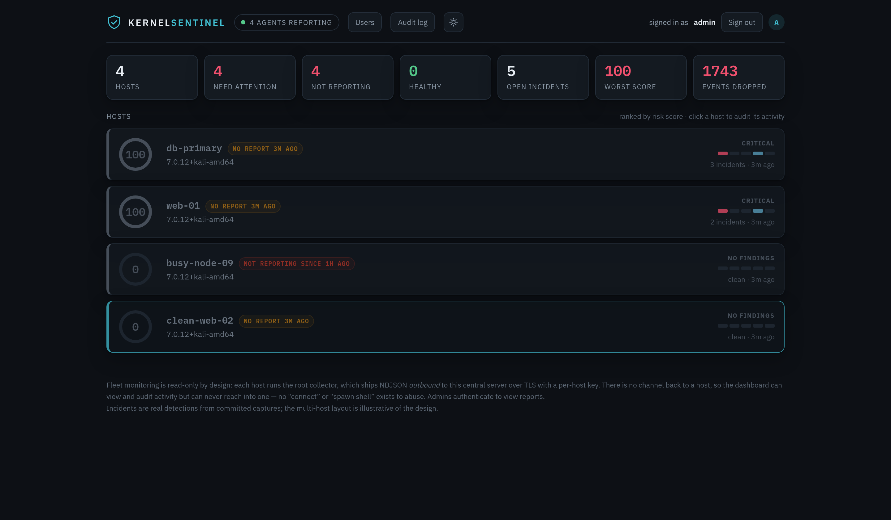
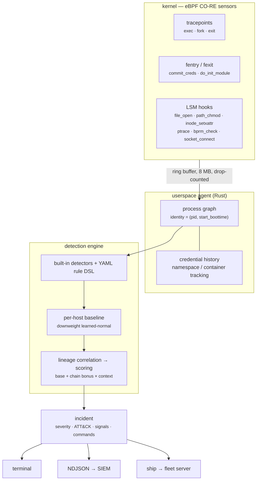
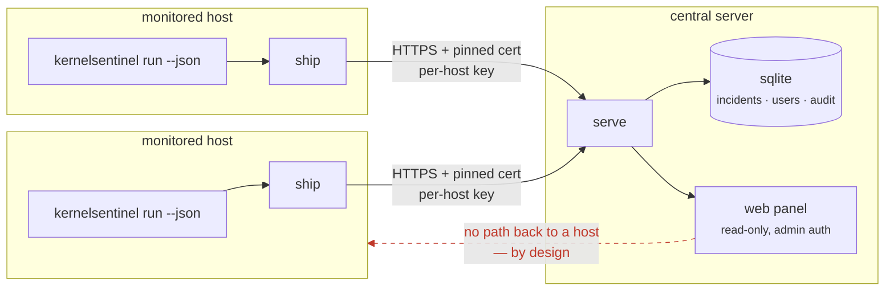
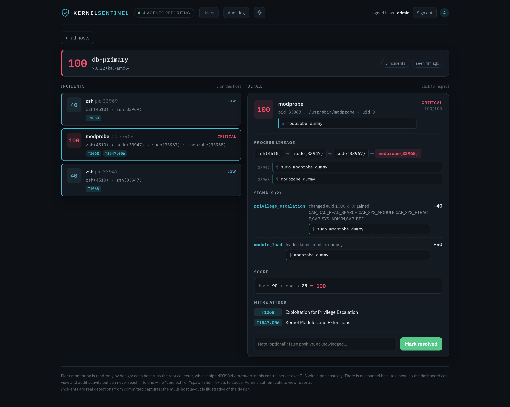

# KernelSentinel

[](https://github.com/SysFr4m3r/kernelsentinel/actions/workflows/ci.yml)

**Runtime detection engine for Linux post-exploitation and privilege-escalation behavior, using eBPF.**

Most process monitors hand you a firehose of syscalls and leave the thinking to you. KernelSentinel is
built the other way round: eBPF sensors feed a **live process behavior graph**, and a correlation
engine turns causally-linked events into a small number of high-signal, MITRE-mapped alerts.

The difference is the unit of output. Not this:

```
execve("/bin/sh")
memfd_create("", 1)
execve("/proc/self/fd/7")
setresuid(0, 0, 0)
```

But this — real output, from a real captured attack:

```
CRITICAL  risk 100/100  [T1068, T1548.001]
  zsh(4510) -> sudo(7429) -> sudo(7449) -> sh(7450) -> chmod(7452)
    privilege_escalation   changed euid 1000 -> 0; gained CAP_SYS_ADMIN,CAP_BPF,...  (+40)
    suid_create            created a new SUID binary /tmp/.x                         (+45)
  score: base 85 + chain 22 = 100
```

Every number decomposes into named parts, because a score nobody can explain is one nobody acts on.

Across a fleet, the same incidents land in a read-only web panel:



---

## Contents

| | |
|---|---|
| **[How it works](#how-it-works)** | the pipeline, in one diagram |
| **[What it detects](#what-it-detects)** | sensors and the built-in detections |
| **[Install](#install)** | packages, requirements, build from source |
| **[Single host](#single-host)** | `run`, `replay`, `investigate` |
| **[Fleet monitoring](#fleet-monitoring)** | central panel, agents, alerting |
| **[Tuning detections](#tuning-detections)** | YAML rules, YARA, baselining |
| **[Design notes](#design-notes)** | the decisions that shape everything else |
| **[Project status](#project-status)** | roadmap, limitations, what is not done |

---

## How it works

Kernel events become a process graph; the graph becomes scored incidents. Correlation is the whole
point — sensors without it produce a tool that cries wolf, and a tool that cries wolf gets turned off.



A web server spawning a shell that runs from memory scores itself, and shows its work:

```
CRITICAL  risk 100/100  [T1059.004, T1620]
  nginx(800) -> sh(900)
    shell_from_network_daemon   nginx(800) spawned a shell (sh)     (+50)
    fileless_exec               executed from memfd (memfd:payload)  (+45)
  score: base 95 + chain 25 x1.30 (lineage rooted at a network daemon) = 100
```

Severity bands: `<25 info · 25–49 low · 50–74 medium · 75–89 high · ≥90 critical`. The daemon alerts
at medium and above, so most single signals stay quiet until they chain — deliberately, because
single events should not cry wolf.

---

## What it detects

**Sensors** (eBPF CO-RE, all verified live on kernel 6.19):

| Sensor | Hook | Catches |
|---|---|---|
| exec / fork / exit | tracepoints | process lineage with full `argv` |
| credential transitions | `fentry/commit_creds` | *every* uid/capability change, including SUID exec and `capset` |
| new SUID/SGID binaries | `lsm/path_chmod` | the classic local-privesc artifact |
| file capabilities | `lsm/inode_setxattr` | a SUID-equivalent backdoor with no SUID bit |
| writes to watched paths | `lsm/file_open` + `bpf_d_path` | `ld.so.preload`, `authorized_keys`, cron, systemd, sudoers, shadow — filtered in-kernel by an LPM trie |
| credential-file reads | `lsm/file_open` | `/etc/shadow` and SSH **private** keys — theft, as opposed to the tampering a write means |
| ptrace / cross-uid `/proc` | `lsm/ptrace_access_check` | credential theft from another user's process |
| runtime socket access | `lsm/socket_connect` | Docker/containerd sockets — the container-escape primitive |
| fileless execution | `lsm/bprm_check_security` | memfd / anonymous / deleted-file exec |
| kernel module load | `fexit/do_init_module` | rootkit loading, by real module name |
| kernel escape hatches | `lsm/file_open` | writes to `core_pattern`, `modprobe`, `uevent_helper` — a root program the kernel runs on the *host* |
| namespace escape | namespace inums at `exec` | a container executing in the host's mount namespace |

**Every detection** — its ATT&CK technique, base score, how to trigger it, and its known false
positives **and known evasions** — is documented in **[docs/DETECTIONS.md](docs/DETECTIONS.md)**.

**Not every kernel has every sensor.** The six `lsm/` hooks need `CONFIG_BPF_LSM`, which RHEL, Rocky
and Alma do not ship. The agent attaches each program separately and names the ones it could not, so
a kernel without BPF-LSM keeps lineage, credential transitions and module loading rather than
refusing to start. See **[docs/COMPATIBILITY.md](docs/COMPATIBILITY.md)**.

**Cost**: 0.2% of one core and 27 MB idle; 8,262 events/sec sustained with zero loss at 10% of a
core. Loss begins not at a particular rate but when a workload leaves the agent no core to run on —
measured, with the method and caveats, in **[docs/PERFORMANCE.md](docs/PERFORMANCE.md)**.

**The process graph** gives detections what per-event rules cannot see: PID-reuse-proof identity
`(pid, start_boottime)`, parent/child edges, credential history, ancestry walks, a retention window,
hard memory caps, and `/proc` bootstrap for processes that predate the daemon.

**Tested** on four levels. 171 unit and integration tests, including detections replayed from
**real kernel captures** committed as fixtures. 25 [attack scenarios](#testing) that run the
real attack against a live agent and assert it is caught — because replay tests feed the detector
events it was given, which is how a container escape detection once passed everything and failed
against the actual attack. And seven noise scenarios asserting ordinary work stays
silent, because a tool that catches everything and fires on `docker run` gets muted in week one. One
of those asserts the *absence* of a specific signal rather than general quiet — the only assertion
shape that can catch a suppression having stopped working, which no amount of attack scenarios
can, since a suppression that fails open makes the attack tests pass harder. Another runs twice, to
check that the answer this project's documentation gives to a known false positive — *baseline it* —
actually works: the activity must alert without a baseline learned from it, and go quiet with one.

And the sensors are loaded into a real kernel on every push, which is newer than the rest of this
list and found more than it should have: a verifier rejection that only one compiler produced, and
an agent reporting eleven working sensors on a host where six were inert. CI attaches on x86_64 and
aarch64, and boots the runner's own kernel under QEMU with `lsm=...,bpf` appended so the six
BPF-LSM sensors — most of the detection surface — fire somewhere other than the machine this was
written on.

---

## Install

### From a release (recommended)

Prebuilt packages, no toolchain required. The agent binary is CO-RE, so one
build runs across kernels — libbpf relocates against the target kernel's own BTF
at load.

Download both from the [latest release](https://github.com/SysFr4m3r/kernelsentinel/releases/latest), then:

```bash
sudo apt install ./kernelsentinel-server_*_amd64.deb   # central box
```

```bash
sudo apt install ./kernelsentinel-agent_*_amd64.deb    # monitored host
```

Neither package starts its service. An agent with no ingest key, or a server with
no admin password, would crash-loop — so each prints its configuration steps on
install instead of leaving you with a broken unit. Other distributions: use the
tarballs, and verify with `sha256sum -c SHA256SUMS`.

Releases are built on Ubuntu 22.04, so **glibc 2.35** is the floor.

### From source

Only needed to build the agent yourself, or to hack on it.

| | |
|---|---|
| Kernel | **5.11+** — `bpf_get_current_task_btf` is used by every program. Full sensor set needs `CONFIG_BPF_LSM=y` **and** `bpf` in `/sys/kernel/security/lsm`; without it the agent still runs, minus the file, ptrace and socket sensors |
| BTF | `/sys/kernel/btf/vmlinux` must exist (`CONFIG_DEBUG_INFO_BTF=y`) |
| Privileges | root, or `CAP_BPF` + `CAP_PERFMON` |
| Toolchain | clang 11+, libbpf 1.x, bpftool, Rust 1.75+ |

**1. Toolchain.** The BPF side is compiled with clang against libbpf; the userspace is Rust.

```bash
sudo apt install -y clang llvm libelf-dev zlib1g-dev libbpf-dev bpftool pkg-config
```

```bash
curl --proto '=https' --tlsv1.2 -sSf https://sh.rustup.rs | sh -s -- -y
```

The BPF side is one translation unit split across headers — `bpf/maps.h`,
`bpf/common.h`, and one file per sensor under `bpf/sensors/`, all included by
`bpf/kernelsentinel.bpf.c`. It is a single object on purpose: every program
shares those maps, and separate `.bpf.c` files would compile to separate objects
with separate ring buffers.

**2. Generate `vmlinux.h`.** Host-specific and not committed; CO-RE regenerates it from your
kernel's BTF. The script picks a `bpftool` that can actually parse it, falling back to a pinned
upstream build when the packaged one is too old — which is common, and is exactly what CI runs:

```bash
./scripts/gen-vmlinux.sh
```

**3. Build.** The binary is `target/release/kernelsentinel`; everything below assumes it is on your `PATH`.

```bash
cargo build --release
```

To build the distributable packages instead:

```bash
./packaging/build-deb.sh
```

**4. Check your host is supported.** Reports kernel, BTF, LSM and privileges, and exits non-zero if a
hard requirement is missing:

```bash
sudo kernelsentinel doctor
```

Developed against kernel 6.19 on Kali. Per-sensor requirements, distribution
support and how to enable BPF-LSM are in **[docs/COMPATIBILITY.md](docs/COMPATIBILITY.md)**.

---

## Single host

The daemon streams events and raises correlated incidents:

```bash
sudo kernelsentinel run
```

Emit incidents as NDJSON for a SIEM or pipeline (suppresses the event stream):

```bash
sudo kernelsentinel run --json
```

Each incident is one self-contained, version-tagged JSON object:

```json
{"schema":"kernelsentinel.incident/v1","severity":"CRITICAL","score":100,
 "subject":{"pid":7452,"comm":"chmod","exe":"/usr/bin/chmod","uid":0},
 "lineage":["zsh(4510)","sudo(7429)","sh(7450)","chmod(7452)"],
 "attack":["T1068","T1548.001"],"signals":[…]}
```

<details>
<summary><b>Timestamps: <code>ts</code> vs <code>ts_ns</code></b></summary>

Incidents and signals carry `ts` (wall clock, epoch milliseconds) and `ts_ns` (the kernel's boot
clock). `ts_ns` differences are exact, so ordering inside a chain is always trustworthy. `ts` is
**absent when replaying a capture**: a recording never stored the boot-to-wall offset, so any wall
time derived from it elsewhere would be invented. The panel shows the agent's event time when it has
one and clearly labels the server receive time when it does not.
</details>

### Try it without waiting for an attack

`record` captures events; `replay` runs them back through the engine unprivileged and
deterministically — no root, no kernel:

```bash
sudo kernelsentinel record -o capture.ndjson
```

```bash
kernelsentinel replay capture.ndjson
```

The repository ships real captures as fixtures, so you can see a detection immediately:

```bash
kernelsentinel replay tests/fixtures/host_sudo_suid.ndjson
```

### Inspect the process tree

`tree` reconstructs the current process tree from `/proc` — useful for checking what the graph sees
before any attack happens:

```bash
kernelsentinel tree --pid 1
```

### Investigate one process

```bash
kernelsentinel investigate 7452 --capture tests/fixtures/host_sudo_suid.ndjson
```

```
=== PID 7452 chmod ===
executable : /usr/bin/chmod
lineage    : zsh(4510) -> sudo(7429) -> sudo(7449) -> sh(7450) -> chmod(7452)
risk       : CRITICAL 100/100  (base 85 + chain 22)
signals:
  privilege_escalation   changed euid 1000 -> 0; gained CAP_SYS_ADMIN,...  (+40)
  suid_create            created a new SUID binary /tmp/.x                 (+45)
MITRE ATT&CK:
  T1068        Exploitation for Privilege Escalation
  T1548.001    Setuid and Setgid
```

---

## Fleet monitoring

One binary, two roles chosen by subcommand: on monitored hosts it is the **agent** (`run` + `ship`);
on the central box it is the **server** (`serve`).

Telemetry flows **one way**. There is no channel from the panel back to a host, so a compromised
dashboard cannot reach into the fleet — no "connect" or "spawn shell" exists to abuse.


### On the central server

Generate a TLS cert (or use one from your CA) and a per-host key for each agent, then start the server:

```bash
export KS_ADMIN_PASSWORD='choose-a-strong-admin-password'

kernelsentinel serve \
  --bind 0.0.0.0:8088 \
  --keys /etc/kernelsentinel/agents.keys \
  --journal /var/lib/kernelsentinel/incidents.sqlite \
  --retain-days 90 \
  --tls-cert /etc/kernelsentinel/server.pem \
  --tls-key  /etc/kernelsentinel/server.key
```

`agents.keys` is one `hostname key` per line. The key **binds** the host, so a leaked key can only
ever write its own host's data:

```text
web-prod-01   4f8c1e…   # generate each with: openssl rand -hex 32
db-app-03     9a2b7d…
```

**`chmod 600` it.** The file is the fleet's ingest credentials in plaintext, and a key is all it
takes to write incidents as that host. The server refuses to start if the file is world-readable
rather than warning, because there is nothing downstream that can tell an incident written with a
stolen key from a real one. It also refuses two hosts sharing a key — the second would file its
incidents under the first's name with nothing to indicate it. One host holding several keys is
allowed, which is how a rotation happens without a gap.

Admins open `https://central:8088` and sign in as **admin** with that password (seeded from
`KS_ADMIN_PASSWORD` on first start). From the **Users** view an admin can add more accounts (admin or
viewer); each resolution records the real username. Sessions are signed tokens, so they survive a
server restart.

### On each monitored host

Copy the binary and the server's certificate to the host, then pipe live incidents to the server:

```bash
export KS_INGEST_KEY='this-hosts-key-from-agents.keys'

sudo kernelsentinel run --json \
  | kernelsentinel ship https://central:8088/api/ingest \
      --host web-prod-01 \
      --ca /etc/kernelsentinel/server.pem
```

- `run --json` is the root collector emitting incidents as NDJSON.
- `ship` forwards them; `--ca` **pins** the server's certificate — the agent trusts only that exact
  cert, so no public CA can impersonate the server.
- `--host` labels this host (omit to use the system hostname).

Run it under systemd so it stays up. A minimal unit:

```ini
[Service]
Environment=KS_INGEST_KEY=this-hosts-key
ExecStart=/bin/sh -c '/usr/local/bin/kernelsentinel run --json | /usr/local/bin/kernelsentinel ship https://central:8088/api/ingest --ca /etc/kernelsentinel/server.pem'
Restart=always
```

A ready-made deployment (hardened units, install script) lives in **[deploy/](deploy/)**.

> **No TLS yet?** For a quick localhost trial, drop the `--tls-*` and `--ca` flags and use `http://`.
> The server then binds `127.0.0.1` and warns. Never expose plain HTTP off localhost — the ingest key
> travels in a header.

### Contributing

The most useful contributions are not code. `docs/COMPATIBILITY.md` has one
verified row, the false-positive rate has never been measured on a busy host
over a long period, and a detection that misses is the most serious kind of bug
here. **[CONTRIBUTING.md](CONTRIBUTING.md)** says what to send and what a
detection needs to be accepted; **[SECURITY.md](SECURITY.md)** covers reporting a
vulnerability privately.

### Reading an incident

The dashboard updates in real time: it holds a long-poll open and refreshes the moment an agent ships
an incident. Opening one shows **when each step happened** — an absolute UTC time per signal plus the
offset from the start of the chain — and **the command line of every process in the chain**, so
"a SUID binary appeared" arrives with the `chmod u+s /tmp/.x` that did it:



Every incident in both screenshots is a real detection, replayed from the capture fixtures committed
under `tests/fixtures/` — you can reproduce the same output with `kernelsentinel replay`. Only the
host names are invented, so the fleet view has more than one row.

Command lines are **redacted for secrets** before they leave the host: `mysql -p<redacted>` keeps the
fact that a password was passed inline without carrying the value into the panel, the journal, a
webhook, or syslog.

### Fleet activity

The per-host view answers "how is web-01?". The **Activity** view answers "what just happened
anywhere?" — every host's incidents in one list, newest first. Clicking one opens the host it
happened on with that incident selected, so a finding always arrives next to the rest of that host's
activity rather than as a detached copy.

The **search field** filters as you type across host, command line, process lineage, signal id and
detail, ATT&CK technique, and YARA rule name — so `modprobe`, `dummy`, `T1547.006` and `module_load`
all find the same kernel-module incident. Multiple words narrow rather than widen
(`db-primary modprobe`), `/` focuses the field and `Esc` clears it. It searches the loaded window of
recent incidents, and the header says how many that is.

### Agent liveness

Agents check in every 60s even when they have nothing to report, so the panel can tell a **healthy
host from a dead agent** — silence is otherwise identical to safety, and "the sensors stopped
reporting" is exactly what a root-level attacker leaves behind.

The check-in also **attests**: the agent execs a child each interval and confirms its own sensors
observed it. Root with `CAP_BPF` can detach a BPF link from a running process, after which a
heartbeat alone would keep the host looking healthy while it sees nothing — so a host that reports in
but fails its own check is shown as **reporting but blind**, ranked above every other unhealthy state.

A host that stops reporting is ranked as needing attention rather than shown as clean. The check-in
also carries the ring-buffer **drop counter**: dropped events are missed detections, so a host that
lost them is never presented as fully covered. An older agent that sends no heartbeat reads as
`no heartbeat`, not as dead.

### Alert delivery

A finding that only reaches a dashboard is one nobody sees until somebody thinks to look. The server
pushes incidents to a chat webhook and to syslog:

```bash
kernelsentinel serve --bind 0.0.0.0:8088 \
  --alert-webhook https://hooks.example.com/services/XXX \
  --alert-syslog \
  --alert-min-severity HIGH \
  --alert-max-per-min 30
```

The alert names the **command**, not just the finding:

```
CRITICAL 100/100 on web-01 — chmod: chmod u+s /tmp/.x [T1068, T1548.001]
```

The webhook body carries a Slack/Mattermost-compatible `text` field alongside structured fields, so a
chat hook works out of the box without giving up machine-readable detail. HTTPS verifies against the
system trust store; `--alert-webhook-ca` pins a certificate instead.

Delivery runs on its own thread behind a bounded queue, so **a dead webhook cannot slow or block
ingest** — an alerting failure degrades to a logged error, never to backpressure on monitoring.
`--alert-max-per-min` caps delivery so an incident storm cannot become an alert storm; suppressed
alerts are counted and summarized rather than dropped silently. Sinks are configured on the command
line only: a URL the server fetches is an SSRF primitive, so it stays out of reach of the web UI.

### Server-only build

The same source builds two ways. By default you get the full agent: sensors, `run`, `record`,
everything. For the central box, which never runs a sensor:

```bash
cargo build --release --no-default-features
```

That drops the `bpf` feature, so `build.rs` never invokes clang and the binary never links libbpf —
**no clang, no bpftool, no libbpf, no host-specific `vmlinux.h`** required to build it. The result is
20 MB instead of 37 MB and carries no collector code it cannot run.

It keeps everything that does not need a kernel: `serve`, `ship`, `replay`, `investigate`,
`baseline`, `budget`, `rules`, `tree`, `doctor`. Only `run` and `record` are absent, because only
they collect.

The role is still chosen by subcommand rather than by binary name — a separate name would need a
workspace split for no functional gain, since one crate builds all its binaries with the same
feature set.

---

## Tuning detections

### Custom rules (YAML)

Add detections without recompiling — see **[docs/WRITING_RULES.md](docs/WRITING_RULES.md)**:

```bash
kernelsentinel rules --dir rules            # validate + list
sudo kernelsentinel run --rules rules       # load alongside the built-ins
```

### Identify what was found (YARA)

Detection says *that* something is suspicious; YARA says *what it is*:

```bash
sudo kernelsentinel run --json --yara /etc/kernelsentinel/yara.d
```

It runs **only on targets a signal already named** — the file that gained SUID, the module that
loaded, the binary executed from `/tmp`, and `/proc/<pid>/exe` for a fileless exec, which still
resolves to a memfd image that never touched disk. Scanning every file open would rebuild the
signature firehose this project exists to avoid.

Matches are **identification, not scoring**: a hit raises confidence in an existing finding and never
contributes to the number, so one over-broad rule cannot manufacture an incident. Three outcomes stay
distinct — `matched`, `clean`, and `not scanned` when the target was gone before the scan ran. That
last one is routine and honest: a memfd lives only as long as its process, and reporting a lost race
as "clean" would be the dangerous failure.

### Enforcement (optional, off by default)

Everything above only *observes*. The LSM hooks can also **deny**, for one
deliberately narrow case: writes to the kernel escape hatches
(`core_pattern`, `modprobe`, `poweroff_cmd`, `uevent_helper`,
`binfmt_misc/register`) from **outside the host's mount namespace**.

```bash
sudo kernelsentinel run --enforce audit     # report what would be blocked
sudo kernelsentinel run --enforce on        # actually block it
```

**Run `audit` first.** It reports every operation enforcement *would* have
blocked, and blocks nothing, so you find out what breaks before it breaks.

Why only this: each of those files names a program the kernel runs as root on
the host, and a containerised writer has no legitimate use for any of them. The
blast radius of being wrong is "a container cannot set `core_pattern`". Widening
the set is how a monitoring agent starts taking hosts down, so the deniable
paths are pinned by a test.

Every uncertain path fails **open**. No config, no known host namespace, an
unreadable namespace on the task, or a full ring buffer — all allow. An agent
that blocks something because it could not read a pointer is worse than one that
misses a detection. Denial also refuses to arm at all if the host's mount
namespace cannot be read, because without a reference there is no way to tell
"inside a container" from "is the host".

A blocked operation is still recorded, and the incident says `BLOCKED:` — an
operation stopped without a trace is the worst of both worlds. The score is
unchanged: blocking changes the outcome, not how serious the attempt was.

### Suppress routine behavior (baselining)

Learn a host's normal from a clean capture, then apply it so routine actions (a plain `sudo`) stop
alerting while novel behavior still fires:

```bash
kernelsentinel record --out clean.ndjson          # while the host does its normal work
kernelsentinel baseline --capture clean.ndjson --out host.baseline
sudo kernelsentinel run --baseline host.baseline
```

**Record for hours, not minutes.** A baseline entry is evidence, not a verdict, and how much of a
signal's score it suppresses depends on how good that evidence is:

| | |
|---|---|
| **Support** | How many times the pair was seen. One sighting is not a habit, and keeps ~85% of its score. |
| **Recurrence** | How much of the learning window it spanned. Ten thousand occurrences inside three seconds is one burst, and is capped at half confidence however many times it repeats. |
| **Freshness** | Full strength for 14 days, then decaying to nothing at 90. Past that the baseline suppresses **nothing** and says so. |

Two things follow, both deliberate. An attacker already resident while you record a "clean" capture
cannot whitelist themselves with a single action — that was the old behavior, where membership alone
bought full suppression. And a baseline nobody has re-learned in four months gets out of the way
instead of quietly hiding more as the host drifts from what it learned. **Every one of these
degrades toward alerting**, never toward silence.

`baseline` tells you what it produced, and warns when the capture was too thin to evidence anything:

```
kernelsentinel: learned 47 patterns from 214933 events -> host.baseline
kernelsentinel: 47 patterns (31 strong), 6.2h learning window, learned 0d ago
```

A suppressed signal says so in the incident, with the evidence behind it — `[baseline: seen 42x,
confidence 91%]` — because an alert that quietly did not fire is indistinguishable from a detector
that broke.

### Measure how noisy it is (alert budget)

The attack suite proves detections fire and the noise suite proves five short scenarios stay quiet.
Neither answers the question you actually decide on: **how many alerts will this produce per day on
my machine, and what are they?**

Record a host doing ordinary work, then measure the capture. If nothing malicious happened while it
was recording, *every* incident in it is a false positive — the capture is the assertion, since
nothing here can label ground truth on its own:

```bash
kernelsentinel record --out normal-day.ndjson     # while the host does its usual work
kernelsentinel budget --capture normal-day.ndjson
```

```
  floor       incidents    per day
  INFO              118      123.1
  LOW               118      123.1
  MEDIUM             70       73.0
  HIGH               47       49.0
  CRITICAL            1        1.0

  what fired at medium
         38x  privilege_escalation
         32x  module_load
```

Pass `--baseline` to measure with one applied, and it shows what the baseline removed rather than
asserting a benefit — on the capture above, 73 medium alerts a day became zero. `--json` emits the
same measurement for tracking it across releases.

It refuses to extrapolate a daily rate from a capture under an hour, for the same reason a baseline
entry seen once earns almost no confidence: a number invented from thin evidence is worse than no
number.

**Measured once so far:** 2.3 hours of ordinary desktop use, 219,066 events at 27/sec, **zero
alerts at the default `medium` floor** with no baseline applied. Thirteen low-severity signals
fired and none reached the floor alone — which is what scoring them below it is for. That is one
desktop, not a fleet; [docs/PERFORMANCE.md](docs/PERFORMANCE.md) has the breakdown and what it does
not establish.

---

## Design notes

A few decisions that shape everything else, and why the obvious alternative is wrong.

**Hook LSM and `commit_creds`, not syscalls.** `sys_enter_setuid` misses credential transitions that
don't come through that syscall — SUID exec, `capset`, kernel paths — and double-fires on others.
Hooking `commit_creds` and diffing old against new credentials catches *every* transition, for free.

**Never read a path from a userspace pointer at syscall entry.** It is pre-canonicalization and
TOCTOU-racy, which is a real detection bypass rather than a theoretical one. File sensors use LSM
hooks with `bpf_d_path()` on the resolved `struct file`. Even `argv` is read from the new process's
`mm->arg_start` *after* the exec completes.

**A sensor that attached is not a sensor that works.** The kernel accepts a BPF-LSM program whether
or not `bpf` is in `/sys/kernel/security/lsm`; only the hook being *invoked* depends on that. So the
attach count everyone reaches for is a claim about a syscall's return value, and on stock Ubuntu it
read `11 of 11` while six sensors sat bound to hooks the kernel never called. Measured, not guessed:
a real `chmod u+s` and a real read of `/etc/shadow` on that host produced nothing at all. The agent
now reports `5 of 11 sensors active` there and names the six — the count was 11 when that was
measured, and a twelfth sensor has since been added — because a monitoring tool that
overstates its own coverage is worse than one that admits a gap.

**Names may accuse, never exonerate.** `comm` is whatever a process last passed to
`prctl(PR_SET_NAME)`, and an executable's path is a string in some mount namespace. Neither is
evidence. So no rule that *suppresses* a signal is allowed to turn on a name: the programs whose
credential reads are excused are matched by `(device, inode)` against the host's real binaries,
resolved once at startup, and a copy of `cat` at `/tmp/sudo` is not sudo. A rule that only ever
*raises* a signal may still consult a name, because the worst a liar achieves is accusing itself —
that is what still catches shebang-script daemons like `gunicorn`, whose mapped executable is really
the Python interpreter. `doctor` reports how many system binaries it could resolve, because an
unresolved credential reader means its reads start alerting.

**Process identity is `(pid, start_boottime)`, never a bare PID.** PIDs recycle within seconds on a
busy host, and a recycled PID means attributing an attacker's action to an innocent process.

**Filter in the kernel.** Path-based sensors consult an LPM trie of watched prefixes inside the BPF
program. Shipping every `file_open` to userspace would melt the host.

**Detect memfd execution structurally.** String-matching `/proc/self/fd/` is trivially evaded by
re-opening the descriptor elsewhere; the superblock magic and `memfd:` dentry name are not.

**Risk scores are explainable.** Fixed per-signal contributions, a chain bonus so causally-linked
signals beat unrelated ones, and context modifiers. Every alert prints its breakdown.

<details>
<summary><b>Why a graph, and not more rules</b> — two measurements</summary>

A 40-second capture on an idle desktop produced 230 exec events, 79% of them from a single panel
applet polling for a VPN address once a second. In the same capture, an automated shell session
appeared as: a non-interactive `zsh -c` spawned by a non-shell parent, sourcing a script from a
dotfile directory, immediately spawning a binary that recursively scanned the filesystem.

Structurally, that is indistinguishable from a webshell dropping into reconnaissance. What separates
them is not in any single event — it is the ancestry (the parent is a terminal in a user session, not
a network daemon), the credential history (no uid transition), and the session context. Per-event
rules cannot see any of that.

A second measurement makes the same point from the other direction. A single `sudo id` produces
**eight** credential transitions — sudo brackets its privileges, dropping to euid 1 and back around
each operation. Every one is a real transition, correctly captured, and individually meaningless. The
fact worth alerting on is the net result (`uid 1000 → 0, gained CAP_SYS_ADMIN`), which only exists
once you correlate them per process.
</details>

---

## Project status

The full pipeline is built and validated on real kernel captures: **eBPF sensors → process graph →
correlation engine → scored, MITRE-mapped alerts**, in both human and NDJSON form.

Still a young project — not yet a packaged release, and the false-positive tuning that separates a
production EDR from a research tool is ongoing. Do not deploy it as your only line of defense. But it
detects real post-exploitation chains today, and every detection is covered by a test replaying a
real capture.

| | Milestone | Status |
|---|---|---|
| M0 | BPF pipeline, exec sensor, `doctor` | ✅ done & verified |
| M1 | fork/exit, `commit_creds`, process graph, `/proc` bootstrap | ✅ done & verified |
| M2 | File sensors (LSM, `bpf_d_path`), ptrace, memfd, module load | ✅ done & verified (all 6 sensors) |
| M3 | Built-in detections, risk scoring, alerts, `investigate`, NDJSON | ✅ done & validated |
| M4 | `record`/`replay`, Docker lab, real-capture fixtures | ✅ core done |
| M5 | YAML rule DSL (match + sequence rules) | ✅ first increment |
| M6 | Container & namespace awareness | ✅ container id, context multiplier, runtime-socket, namespace and escape-hatch detection |
| M7 | Baselining ✅ · heartbeat + drop telemetry ✅ · alert delivery ✅ · YARA ✅ · optional enforcement ✅ | ✅ done |

### Limitations

Stated up front, because a security tool that hides these is worse than one that has them.

- **Detect-only by default.** Enforcement exists (`--enforce`) but covers one narrow case: kernel
  escape-hatch writes from a non-host mount namespace. Everything else observes and never blocks.
- **Not an auditd replacement.** KernelSentinel logs what feeds detections, not everything.
- **eBPF sees nothing before it attaches.** The `/proc` bootstrap reconstructs existing processes, but
  their history is inferred and marked as such.
- **Paths are best-effort.** Mount namespaces, bind mounts, and overlayfs all complicate resolution;
  events carry `(dev, inode)` alongside the path so it can be re-resolved.
- **A determined attacker with root can unload the sensors.** This is a detection tool, not a rootkit
  defense. The agent heartbeat makes that *visible* — a host that goes quiet is flagged rather than
  assumed healthy — but an attacker who keeps the agent running while blinding it is still ahead.
  Liveness is derived at read time, so "not reporting" is accurate but is not an auditable event.
- **False positives are the hard part.** Package managers, `sudo`, systemd, container runtimes, and CI
  all do "suspicious" things constantly. Tuning that out is the ongoing work.

---

## Reference

### Testing

```bash
cargo test
```

Those replay real captures through the engine — deterministic, no root. But they
feed the detector events that were *recorded or constructed*, which cannot tell
you whether a live attack still produces the signal it should. A container escape
detection once passed all of them and failed against the real attack.

The attack suite closes that gap: it runs each scenario for real against a live
agent and asserts the agent's own output names the expected signal.

```bash
sudo tests/attack/verify.sh
```

```bash
sudo KS_ENFORCE=on tests/attack/verify.sh
```

Documentation drift is a test, not a habit. `tests/docs_consistency.rs` asserts that every signal
the detectors can emit is documented in `docs/DETECTIONS.md` and has an attack scenario, that the
kernel floor in `doctor.rs` matches what the docs claim, and that the counts quoted here are current.
Each of those was wrong at some point, and each was found by someone noticing — which does not scale.

A failure there means an attack really happened and the sensor did not report
it — the failure mode replay tests cannot detect. Each scenario declares what it
must produce in a `ks-expect:` header, so adding a detector without a scenario is
visible rather than silent.

The same run also answers the opposite question. `tests/noise/` holds ordinary
work — an idle desktop, a compile, starting a container, a package-metadata
refresh — and asserts it stays **silent** at the severity an operator actually
alerts on. Anything that fires is reported as a `FALSE POSITIVE`, named, so it is
a finding rather than an impression.

That distinction is the whole point: a tool that catches every attack and fires
twice a day on `dpkg` gets muted in week one, and then its detection quality
stops mattering.

> ⚠️ The attack scenarios in `tests/scenarios/` are **deliberately destructive** — they create SUID
> binaries, load modules, and write to `/etc`. Run them only in a disposable VM, never on your host.

### Documentation

- **[docs/DETECTIONS.md](docs/DETECTIONS.md)** — every detection: what it catches, its ATT&CK
  technique and score, how to trigger it, and its known false positives and evasions.
- **[docs/WRITING_RULES.md](docs/WRITING_RULES.md)** — add detections in YAML, no recompile: the
  match/sequence rule DSL, conditions, and scoping.
- **[docs/COMPATIBILITY.md](docs/COMPATIBILITY.md)** — which kernels and distributions run this,
  what each sensor requires, and what is lost without BPF-LSM.
- **[docs/PERFORMANCE.md](docs/PERFORMANCE.md)** — CPU, memory, event throughput and the rate at
  which the ring buffer starts dropping, reproducible with `scripts/bench.sh`.
- **[deploy/](deploy/)** — systemd units and an install script for a real deployment.

### License

Dual-licensed, split by directory:

- **`bpf/` — GPL-2.0** ([`bpf/LICENSE`](bpf/LICENSE)). Not a formality: `bpf_d_path()` and
  `bpf_probe_read_kernel_str()` are GPL-only helpers, and the verifier rejects a program whose
  `license` section does not declare a GPL-compatible license.
- **Everything else — Apache-2.0 OR MIT**, at your option
  ([`LICENSE-APACHE`](LICENSE-APACHE), [`LICENSE-MIT`](LICENSE-MIT)) — the Rust ecosystem convention.

Unless you state otherwise, contributions are accepted under these same terms.

### Contributing

The most useful contributions are not code. `docs/COMPATIBILITY.md` has one
verified row, the false-positive rate has never been measured on a busy host
over a long period, and a detection that misses is the most serious kind of bug
here. **[CONTRIBUTING.md](CONTRIBUTING.md)** says what to send and what a
detection needs to be accepted; **[SECURITY.md](SECURITY.md)** covers reporting a
vulnerability privately.

### Reading

- [BPF CO-RE reference guide](https://nakryiko.com/posts/bpf-core-reference-guide/) — Andrii Nakryiko
- [libbpf-rs](https://github.com/libbpf/libbpf-rs) — the Rust bindings this is built on
- [MITRE ATT&CK for Linux](https://attack.mitre.org/matrices/enterprise/linux/)
